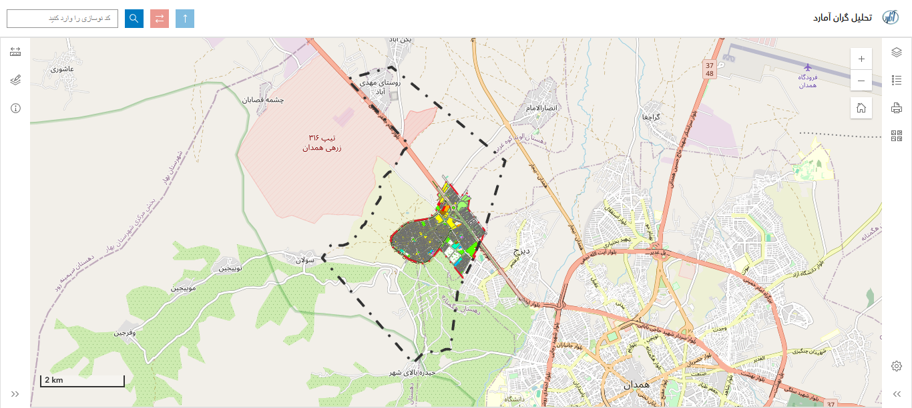
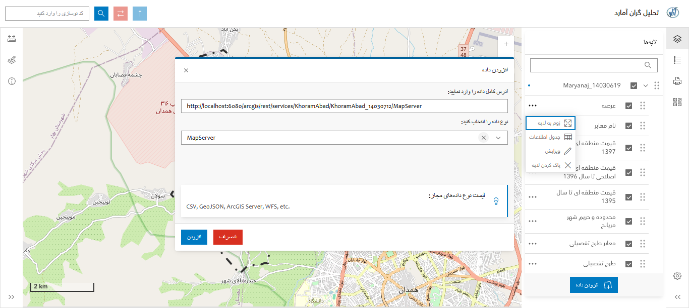
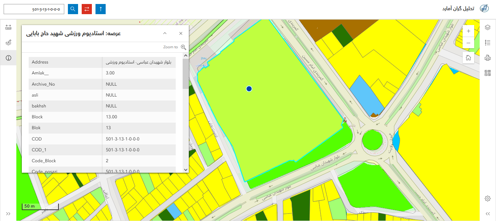
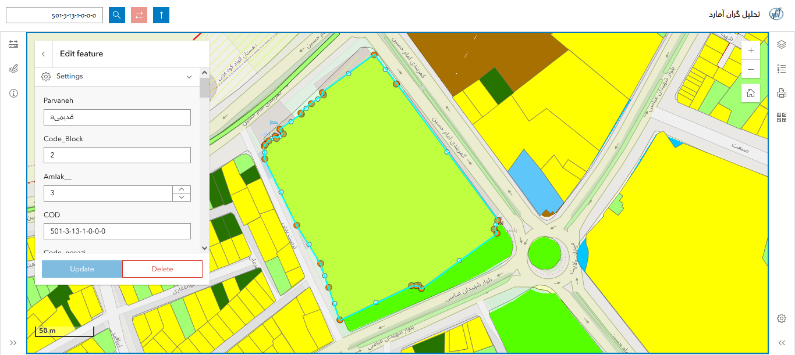
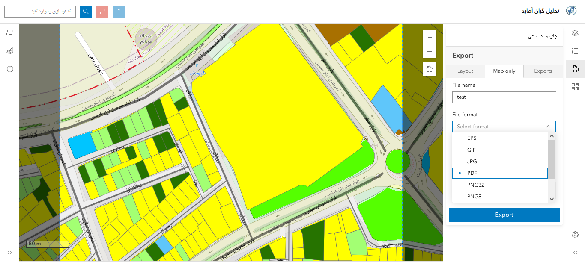

# WebGISApp

A municipal WebGIS application for managing, visualizing, querying, and editing spatial information through a web-based GIS platform.

The application combines **ASP.NET MVC**, **ArcGIS Maps SDK for JavaScript**, **ArcGIS Server**, and **SQL Server Enterprise Geodatabase** to provide integrated GIS and business functionality.

## Overview

WebGISApp is designed as a municipal WebGIS solution that enables users to interact with spatial data through a browser while accessing application-specific business information.

The system follows a hybrid architecture where GIS operations are handled through ArcGIS services, while application and business operations are handled through ASP.NET MVC and SQL Server.

## Technology Stack

| Layer             | Technology                          |
| ----------------- | ----------------------------------- |
| Frontend          | HTML, CSS, JavaScript               |
| UI Framework      | Bootstrap 5                         |
| GIS Client        | ArcGIS Maps SDK for JavaScript 4.30 |
| Backend           | ASP.NET MVC                         |
| GIS Server        | ArcGIS Server 10.2                  |
| GIS Desktop       | ArcGIS Desktop 10.2                 |
| Business Database | SQL Server                          |
| Spatial Database  | SQL Server Enterprise Geodatabase   |
| Web Server        | IIS                                 |

## Key Features

### Map & Visualization

* Layer Management
* Thematic Map
* Popup
* Identify
* Measurement

### Search & Spatial Analysis

* Parcel Search
* Address Search
* Spatial Query
* Feature Selection

### GIS Operations

* Editing
* Drawing
* Map Printing

### Application & Security

* User Management
* Authentication

For a detailed list of capabilities:

[Feature Documentation](docs/features.md)

## Architecture

The application uses a hybrid WebGIS architecture.

```text
                           User
                             │
                             ▼
                       Web Browser
                             │
              ┌──────────────┴──────────────┐
              │                             │
              ▼                             ▼
       ASP.NET MVC                 ArcGIS Maps SDK
              │                    for JavaScript 4.30
              │                             │
              ▼                             ▼
         SQL Server                  ArcGIS Server 10.2
              │                             │
              │                             ▼
              │                  Enterprise Geodatabase
              │                         (SQL Server)
              │
              └──────────────┐
                             │
                             ▼
                  Combined Information
                             │
                             ▼
                           User
```

### Business Data Flow

```text
Browser → ASP.NET MVC → SQL Server
```

### GIS Data Flow

```text
Browser → ArcGIS Maps SDK → ArcGIS Server → Enterprise Geodatabase
```

GIS and business information can be combined and presented through the WebGIS application.

For more details:

[Architecture Documentation](docs/architecture/architecture-overview.md)

## Screenshots

### 01 — Main Map



### 02 — Layer Management



### 03 — Parcel Search



### 04 — Editing



### 05 — Print



## Project Structure

```text
WebGISApp/
│
├── WebGISApp/
│   ├── Controllers/
│   ├── Models/
│   ├── Views/
│   └── ...
│
├── WebGISApp.Tests/
│
├── docs/
│   ├── architecture/
│   │   └── architecture-overview.md
│   ├── screenshots/
│   │   ├── 01-main-map.PNG
│   │   ├── 02-layer-management.PNG
│   │   ├── 03-parcel-search.PNG
│   │   ├── 04-editing.PNG
│   │   └── 05-print.PNG
│   └── features.md
│
├── WebGISApp.sln
└── README.md
```

## Deployment

The application is deployed in an IIS-based environment.

The main infrastructure components are:

```text
IIS
 │
 ├── ASP.NET MVC Web Application
 │
 ├── ArcGIS Server 10.2
 │
 └── SQL Server
      └── Enterprise Geodatabase
```

## Project Documentation

| Documentation                                              | Description                       |
| ---------------------------------------------------------- | --------------------------------- |
| [Features](docs/features.md)                               | Application capabilities          |
| [Architecture](docs/architecture/architecture-overview.md) | System architecture and data flow |

## Project Context

This project represents a municipal WebGIS implementation combining web application development, GIS services, spatial databases, and interactive map functionality.

It demonstrates experience in integrating:

* Web application development
* GIS services
* Spatial data
* Enterprise geodatabases
* Interactive mapping
* Spatial queries
* GIS editing workflows
* Business data integration

## Status

This repository contains a WebGIS application developed using an enterprise GIS technology stack.

The project is maintained as part of a GIS/WebGIS development portfolio and is documented to demonstrate architectural, GIS, backend, and frontend implementation experience.
